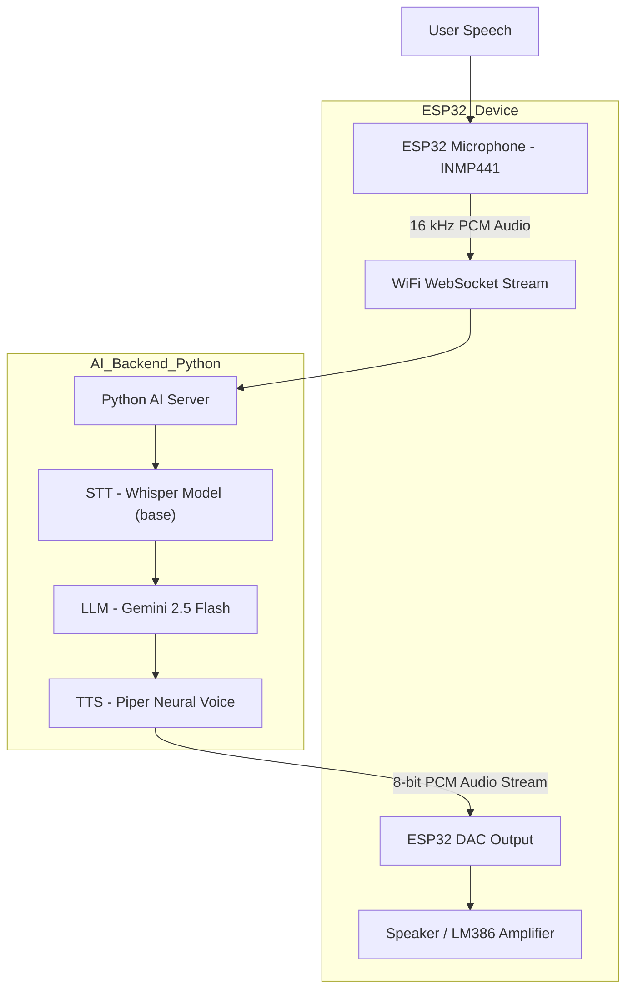

<div align="center">
  
  <p><strong>ESP32 based Voice Assistant</strong></p>
</div>
<br>

# ESP32 based Voice Assistant

---

## Overview

This project combines **embedded system** and **AI inference** to create an end-to-end conversational experience.
The **ESP32** handles real-time audio capture and playback, while the Python based server performs:

- **Speech-to-Text (STT)** using Faster sWhisper
- **Language Understanding** via Google Gemini
- **Text-to-Speech (TTS)** using Piper TTS

---

## System Architecture



---

## Hardware Architecture

| Component                                                                                                                                                                   | Function                                                          | Connection                 |
| --------------------------------------------------------------------------------------------------------------------------------------------------------------------------- | ----------------------------------------------------------------- | -------------------------- |
| **[ESP32-WROOM-32 38Pin Development Board](https://robu.in/product/esp32-38pin-development-board-wifibluetooth-ultra-low-power-consumption-dual-core/)**                    | Main microcontroller handling Wi-Fi, I2S mic input and DAC output |                           |
| **[INMP441 MEMS High Precision Microphone](https://robu.in/product/inmp441-mems-high-precision-omnidirectional-microphone-module-i2s/)**                                    | Captures real-time voice input                                    | `SCK=14`, `WS=15`, `SD=32` |
| **[LM386 Audio Amplifier Module](https://robu.in/product/lm386-audio-amplifier-module/)**                                                                                   | Drives small speaker output                                       | Input from `DAC1 (GPIO25)` |
| **[2inch 8Ohm 12W Midrange Speaker](https://www.rytronics.in/product/2inch-8ohm-12w-midrange-speaker-mid-bass-woofer-audio-speaker-subwoofer/)**                            | Plays synthesized voice from AI                                   | Connected to LM386         |
| **[12x12x12mm Tactile Push Button](https://robu.in/product/12x12x12mm-tactile-push-button-switch-10pcs/)**                                                                  | Triggers recording                                                | GPIO 26                    |
| **[TP4056 Adjustable 1A Li-ion lithium Battery Charging Module](https://robu.in/product/tp4056-1a-li-ion-lithium-battery-charging-module-with-current-protection-type-c/)** | Charges battery                                                   | VIN-(OUT+) / GND-(OUT-)    |
| **[1000mAh Rechargeable 3.7v Lithium Polymer Battery](https://robocraze.com/products/witty-fox-1000mah-rechargeable-3-7v-lithium-polymer-battery)**                         | Battery                                                           | +(B+) / -(B-)              |
| **LED (Built In)**                                                                                                                                                          | Status indication                                                 | GPIO 2 (BUILT IN)          |

> Refer to this sheet for a detailed BOM: [ESP32 Voice Assistant: BOM](https://docs.google.com/spreadsheets/d/1egNmfXN9Qd4uv5BD2DthPwsNbqICtmysUXRfdEgpIic)

The hardware supports **half-duplex streaming**, recording speech, sending it to the backend, waiting for a response and then playing it back via DAC.

---

## Schematic

<div align="center">
  
</div>
<br>

---

## Hardware Workflow

1. **Button Press**, ESP32 starts recording via the INMP441 microphone.
2. **I2S Audio Capture**, 16 kHz samples are streamed in real-time over WebSocket.
3. **AI Processing (Server)**

   - Whisper converts audio → text
   - Gemini 2.5 Flash generates a contextual reply
   - Piper converts text → natural speech

4. **Response Playback**, The server streams 8-bit PCM chunks back to ESP32 for DAC output.
5. **User Hears AI Voice**, LM386 amplifier drives the speaker.

---

## AI Backend (Python Server)

The **AI backend** acts as the brain of the device, hosted locally or on a VPS. It performs all heavy lifting, speech recognition, understanding and voice generation, so the ESP32 stays efficient.

### **Backend Modules**

| Layer                    | Description                                   | Library                 |
| ------------------------ | --------------------------------------------- | ----------------------- |
| **STT (Speech-to-Text)** | Converts voice input to text                  | `faster-whisper`        |
| **LLM (Language Model)** | Generates response based on transcribed query | `google-genai`          |
| **TTS (Text-to-Speech)** | Synthesizes natural human-like voice          | `piper-tts`             |
| **Transport Layer**      | Binary audio streaming and event control      | `websockets`, `asyncio` |

### **Processing Pipeline**

1. **Audio Reception**
   The ESP32 streams 16 kHz PCM data → server buffers in memory.
2. **Transcription**
   Whisper transcribes it into text using a lightweight `tiny` model for fast CPU inference.
3. **Response Generation**
   Gemini Flash LLM interprets intent and composes a short, empathetic response.
4. **Speech Synthesis**
   Piper TTS generates smooth, low-latency speech from text.
5. **Audio Encoding**
   Output audio is converted to 8-bit unsigned PCM and streamed back to the ESP32.

---

## Server Setup

```bash
cd esp-server
pip install uv
uv sync
uv run main.py
```

or via Docker:

```bash
docker build -t esp32-ws-server .
docker run -p 7860:7860 esp32-ws-server
```

> The server runs a WebSocket on `ws://0.0.0.0:7860` to communicate with ESP32.

### **Environment Requirements**

- Python ≥ 3.12
- Google Gemini API key (`GEMINI_API_KEY`)
- Pre-downloaded Piper voice model (`en_US-libritts_r-medium.onnx`)

> Model can be download using the following command:
> `python -m piper.download_voices en_US-libritts_r-medium --data-dir tts_models`

---

## System Highlights

- 🎧 **End-to-end Voice Interaction**, Speak → Understand → Reply → Speak
- ⚡ **Real-Time Processing**, WebSocket-based binary streaming under 100 ms latency
- 🔊 **High-Quality TTS**, Piper’s neural synthesis produces clean, expressive voice output
- 🧩 **Lightweight AI Core**, Whisper Tiny (CPU) enables fast offline operation
- 🧠 **LLM Personality Control**, Adjustable system prompt to alter the AI’s character
- 🔄 **Auto-Restart Watchdog**, `watcher.py` ensures uptime even after failure

---

## Final Outcome

||||
|-|-|-|

---

## License

This project is released under the **MIT License**.
See [LICENSE](./LICENSE) for details.

---

## Acknowledgements

- [Weslei Prudencio for Project Inspiration](https://github.com/wprudencio)
- [Faster Whisper by Systran](https://github.com/systran/faster-whisper)
- [Piper TTS by Rhasspy](https://github.com/rhasspy/piper)
- [Gemini API by Google](https://ai.google.dev/)
- [ESP-IDF & Arduino Core](https://github.com/espressif/arduino-esp32)

---

> Built with ❤️ by **Arpit Sengar**
